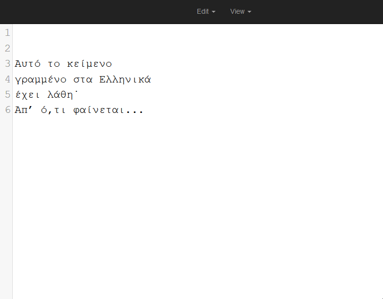

# editor

Try it here: [gogos.me/editor](https://gogos.me/editor/)

`editor` is a static html page which uses [`codemirror`](https://codemirror.net/) and javascript to help you with greek text.

## History...

`editor` was created for some friends who were working on some old Microsoft Word files which had issues regarding Greek (wrong symbols for punctuation, greek words with latin characters inside etc...) and this text had to be fixed before being added to a database. The idea was to copy-paste a piece of text and "visually" be able to check if there are problems. Green color for `Greek` / yellow for `Greek-extended` meant that you were probably OK, red color meant that you might had to correct some characters. The big number of badly-used characters also led us to the creation of functions that do batch replacements/fixes, so there you have it!

## Short demo

